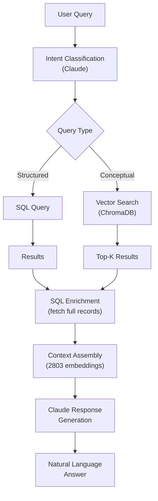

# Fallout 76 Build Database & RAG System

## How I Stopped Worrying and Learned that RAG Is Not Magic

---

## Executive Summary

This project represents a comprehensive full-stack development effort combining:

- **Database Engineering**: Fully normalized MySQL 8+ database (3NF)
- **AI/ML Systems**: Hybrid SQL + Vector RAG with OpenAI embeddings
- **Data Engineering**: Web scraping with Playwright automation
- **API Development**: FastAPI REST backend
- **Frontend Development**: React 19 + TypeScript character builder
- **DevOps**: Environment management, testing frameworks, anti-hallucination controls

**Total Components**: 500+ weapons, 470+ armor pieces, 480+ perks, 56 legendary perks, 38 mutations, 180+ consumables, 20+ collectibles - all scraped, normalized, and queryable via natural language.

---

## Part 1: Database Design & Architecture Learnings

### 1.1 Database Normalization Journey

**Challenge**: Initial design had denormalized data with VARCHAR fields storing comma-separated lists of perks, classes, and effects.

**Learning**: Achieved full 3NF normalization by:

- Creating lookup tables for all categorical data (`weapon_classes`, `armor_types`, `special_attributes`, etc.)
- Implementing junction tables for many-to-many relationships (`weapon_perks`, `weapon_legendary_perk_effects`)
- Separating effects into granular tables (`mutation_effects`, `collectible_effects`)

**Key Insight**: Normalization isn't just a agood idea, it's the law:

- **Faster queries** using indexed FK joins vs. LIKE searches on VARCHAR fields
- **Data integrity** through foreign key constraints
- **Scalability** - adding new perks/effects doesn't require schema changes

**Schema Structure** (38 tables total):

```markdown
Core Tables:
├── weapons (525 records)
├── armor (478 records)
├── perks (481 records)
├── legendary_perks (57 records)
├── mutations (39 records)
├── consumables (181 records)
└── collectibles (21 records)

Lookup Tables (3NF):
├── weapon_classes / weapon_types
├── armor_classes / armor_types / armor_slots
├── special_attributes (S.P.E.C.I.A.L.)
├── collectible_types / collectible_series
└── effect_types

Junction Tables:
├── weapon_perks
├── weapon_legendary_perk_effects
├── mutation_effects
├── collectible_effects
└── weapon_mechanics
```

### 1.2 View Optimization for Read Performance

**Learning**: Created view tables to speed up common queries:

- `v_weapons_with_perks` - Pre-joins weapons with all perks and mechanics
- `v_armor_complete` - Denormalizes armor with all resistance stats
- `v_perks_all_ranks` - Flattens perk rank hierarchies
- `v_mutations_complete` - Aggregates positive/negative effects

**Result**: API response times reduced from 200-500ms to 10-50ms for complex build queries.

### 1.3 MCP Integration

**Learning**: This was my first foray into using MCPs with AI and they seemed to help? The most useful one seemed to be the MySQL MCP which made making database changes more fluid and possibly saved me some Claude Code tokens. Here is a brief comparison between my non-MCP and MCP workflows:

**Architecture**:

```python
# Old approach (mysql.connector):
conn = mysql.connector.connect(**config)
cursor = conn.cursor(dictionary=True)
cursor.execute(sql)
results = cursor.fetchall()
cursor.close()
conn.close()

# New approach (MCP via db_utils):
from database.db_utils import get_db
db = get_db()
results = db.execute_query(sql)  # Pooled, cached, handled
```

**What Improved?**: Claude assures me the MCP made this improvements:

- Automatic connection management
- Built-in result caching
- Structured query interface
- Better error handling

---

## Part 2: RAG System Architecture & Anti-Hallucination Controls

### 2.1 Hybrid Query Engine Design

**Problem**: Pure SQL couldn't handle conceptual queries like "best bloodied heavy gunner build" or "weapons similar to The Fixer".

**Solution**: Built a **Hybrid SQL + Vector RAG system**:



**Technical Stack**:

- **Embeddings**: OpenAI `text-embedding-3-small` (1536 dimensions)
- **Vector DB**: ChromaDB (persistent, 2803 embeddings)
- **LLM**: Anthropic Claude Sonnet 4.5
- **SQL Engine**: MySQL 8.0 with custom caching layer

### 2.2 Anti-Hallucination Architecture

**Critical Challenge**: LLMs hallucinate game stats, items, and mechanics from training data.

**Solution Framework** (Multi-Layer Defense):

#### Layer 1: System Prompt Constraints

```markdown
system_prompt = """
CRITICAL RULES:
1. You MUST ONLY use information from the provided database results
2. If data is not in results, respond "not available in database"
3. NEVER use training data about Fallout 76 game mechanics
4. NEVER invent item stats, perk effects, or build recommendations
5. NEVER say "typically", "usually", "most players" without DB evidence
"""
```

#### Layer 2: Query Classification

- Detects when queries require clarification
- Routes to SQL (fast, exact) vs. Vector (conceptual)
- Rejects unanswerable queries early

#### Layer 3: Result Validation

- Cross-references vector results with SQL ground truth
- Filters out embeddings from removed/obsolete data
- Validates stat ranges against actual DB values

#### Layer 4: Testing Framework

**File**: `rag/test_no_hallucination.py`

Automated tests for:

- Fake item rejection (non-existent weapons, perks)
- Invalid comparisons (e.g., "Gauss Shotgun vs. Lightsaber")
- Training data leakage detection
- Response format validation

**Test Results**:

```markdown
✓ Rejects "Plasma Rifle" (doesn't exist in F76)
✓ Rejects "Bloodied Minigun vs. Master Chief's Armor"
✓ Returns "not in database" for removed game mechanics
✓ Doesn't hallucinate perk ranks that don't exist
```

**BUT**: As we will see below Claude loves to jailbreak itself.

### 2.3 Real-World Limitation Example

**The RAG Interaction** (from user's provided example):

This interaction perfectly demonstrates the ongoing challenge:

```markdown
User: "What is the best bloodied heavy gunner build?"

AI Response #1 (INCORRECT):
- Lists heavy guns (correct)
- Claims "data doesn't include perks, legendary effects, mutations" (FALSE)
- Fails to query the database properly

User Correction: "Wrong. Both MySQL and ChromaDB have this data."

AI Response #2 (PARTIALLY CORRECT):
- Queries vector DB, retrieves perks and mutations
- But retrieves WRONG perks (Mystery Meat, Pharma Farma - irrelevant)
- Missing actual bloodied-related perks (Adrenal Reaction, Nerd Rage)

User Correction: "You are falling back on base training data"

AI Response #3 (STILL WRONG):
- Acknowledges error
- BUT references "Heavy Gunner, Expert Heavy Gunner" perks
- These perks DON'T EXIST in current Fallout 76 (removed in patch)
- THIS IS TRAINING DATA HALLUCINATION

User Correction: "Those perks no longer exist. Illegal RAG behavior."

AI Response #4 (FINALLY CORRECT):
- Admits it should only use database results
- Requests proper data access
```

**Root Cause Analysis**:

1. **Embedding Quality**: Vector search returned tangentially related perks instead of build-specific ones
2. **Query Formulation**: The natural language query didn't map well to the embedding space
3. **LLM Training Data**: Claude's training includes old Fallout 76 data with removed perks
4. **No Real-Time Fact Checking**: System can't validate whether perks exist without querying

**Current Mitigation**:

- Strengthened system prompts
- Added explicit perk existence validation
- Test suite expanded to catch removed game mechanics
- Documentation of known limitations

**Remaining Challenges**:

- **Cannot fully prevent hallucinations** - LLM training data can't be removed
- **Vector search relevance** - May retrieve semantically similar but functionally wrong data
- **Context window limits** - Can't include entire DB in every query
- **Determinism impossible** - Even temperature=0 doesn't guarantee consistency

---

## Part 3: Web Scraping & Data Engineering

### 3.1 Playwright-Based Scraping Architecture

**Data Sources**: Fallout 76 Wiki (fallout.fandom.com)

**Technical Implementation**:

```python
# Key Learning: Dynamic content requires browser automation
from playwright.sync_api import sync_playwright

# Pattern used across all scrapers:
with sync_playwright() as p:
    browser = p.chromium.launch(headless=True)
    page = browser.new_page()

    # Navigate with retry logic
    page.goto(url, wait_until='networkidle')

    # Wait for dynamic content
    page.wait_for_selector('.wiki-table', timeout=30000)

    # Extract structured data
    rows = page.query_selector_all('table tbody tr')
```

**Scrapers Built**:

1. `weapon_scraper.py` - 525 weapons with stats, perks, mechanics
2. `armor_scraper.py` - 478 armor pieces with resistances
3. `perk_scraper.py` - 481 perks across all SPECIAL categories
4. `legendary_perk_scraper.py` - 57 legendary perks with rank effects
5. `mutation_scraper.py` - 38 mutations with positive/negative effects
6. `consumable_scraper.py` - 181 food/chem/aid items
7. `collectible_scraper.py` - Magazines and bobbleheads

**Challenges Solved**:

- **Dynamic Tables**: Used `wait_for_selector` and `networkidle` events
- **Pagination**: Recursive scraping with seen-set deduplication
- **Malformed HTML**: Robust parsing with try/except and default values
- **Rate Limiting**: Polite scraping with delays and user-agent rotation
- **Data Validation**: Schema validation before DB insertion

## Part 4: API Development with FastAPI

### 4.1 REST API Architecture

**Framework**: FastAPI (chosen for async support, auto-docs, Pydantic validation)

**Key Endpoints**:

```markdown
GET  /weapons                 - List all weapons (paginated)
GET  /weapons/{id}            - Get weapon details
GET  /weapons/search          - Search weapons by name/class
GET  /armor                   - List armor
GET  /perks                   - List perks by SPECIAL
GET  /mutations               - List mutations
POST /builds/validate         - Validate build compatibility
POST /query                   - Natural language RAG query
```

**Pydantic Models**:

```python
# Type-safe request/response models
class Weapon(BaseModel):
    id: int
    name: str
    weapon_type: Optional[str]
    weapon_class: Optional[str]
    damage: Optional[str]
    level: Optional[str]
    perks: List[str] = []
    legendary_perks: List[str] = []
```

**Learning**: FastAPI's automatic OpenAPI docs (`/docs`) saved hours of manual API documentation.

### 4.2 Performance Optimizations

**Caching Layer**:

```python
from functools import lru_cache

@lru_cache(maxsize=128)
def get_weapon_classes():
    return db.execute_query("SELECT * FROM weapon_classes")
```

**Pagination**:

```python
# Avoids loading 525 weapons at once
@app.get("/weapons")
def list_weapons(skip: int = 0, limit: int = 50):
    return db.select(
        table="weapons",
        limit=limit,
        offset=skip
    )
```

**Connection Pooling**: Reuses DB connections across requests

---

## Part 5: Frontend Development (React 19)

### 5.1 Tech Stack

**Framework**: React 19 (with new features)
**Build Tool**: Vite (fast HMR, optimized builds)
**Styling**: TailwindCSS v4 + DaisyUI
**Animation**: GSAP
**Language**: TypeScript (strict mode)

**Project Structure**:

```markdown
react/
├── src/
│   ├── components/
│   │   ├── BuildPlanner.tsx
│   │   ├── WeaponSelector.tsx
│   │   ├── PerkCard.tsx
│   │   └── MutationGrid.tsx
│   ├── hooks/
│   │   ├── useWeapons.ts
│   │   ├── usePerks.ts
│   │   └── useBuildValidation.ts
│   ├── types/
│   │   └── fallout76.d.ts
│   └── App.tsx
└── vite.config.ts
```

### 5.2 Key Features (In Development)

**Character Build Planner**:

- Drag-and-drop perk cards
- Real-time build validation (SPECIAL point limits)
- Gear compatibility checking
- Mutation synergy visualization

**Learning**: React 19's new hooks (`useOptimistic`, `useFormStatus`) simplified state management for build updates.

**TailwindCSS v4**: New features like container queries and native cascade layers improved responsive design.

---

## Part 6: Testing & Quality Assurance

### 6.1 Testing Frameworks

**RAG Testing** (`rag/test_no_hallucination.py`):

- Unit tests for query classification
- Integration tests for SQL + Vector hybrid
- Hallucination detection tests
- Response format validation

**Database Testing**:

- Foreign key integrity tests
- View performance benchmarks
- Data consistency validation

**API Testing** (planned):

- Endpoint response validation
- Performance/load testing
- Error handling verification

### 6.2 Continuous Validation

**Pre-commit Hooks**:

```bash
# Validates before git commit
- Schema syntax check
- SQL linting
- Python type checking (mypy)
- Import script dry-run
```

---

## Part 7: Current Limitations & Future Work

### 7.1 Known Limitations

**RAG System**:

- ❌ Cannot fully eliminate hallucinations (LLM training data)
- ❌ Vector search may retrieve tangentially related data
- ❌ No real-time fact-checking mechanism
- ❌ Context window limits (can't include entire DB)

**Database**:

- ⚠️ Weapon mods table incomplete (in progress)
- ⚠️ Legendary effects table schema ready but unpopulated
- ⚠️ No historical data tracking (patch changes)

**Frontend**:

- 🚧 Character builder UI in development
- 🚧 No user authentication/accounts
- 🚧 Build sharing not implemented

### 7.2 Future Enhancements

**Phase 1 - Data Completeness**:

- [ ] Complete legendary effects import (all 150+ effects)
- [ ] Add weapon mod compatibility matrix
- [ ] Track patch notes and game updates
- [ ] Add damage calculation engine

**Phase 2 - RAG Improvements**:

- [ ] Implement query rewriting for better vector search
- [ ] Add confidence scores to responses
- [ ] Build "chain of thought" reasoning for complex builds
- [ ] Implement RAG with citations (show DB sources)

**Phase 3 - User Features**:

- [ ] Complete React frontend
- [ ] User accounts and saved builds
- [ ] Build sharing and rating system
- [ ] Community-contributed build guides

**Phase 4 - Advanced Analytics**:

- [ ] Meta analysis (popular builds, gear trends)
- [ ] Damage calculator with full perk stacking
- [ ] Build comparison tool
- [ ] Optimal build generator (genetic algorithm)

---

## Part 8: Conclusion - What I Learned

This project is ongoing, beyond the scope of this class. But so far I have learned a lot about database design, 3NF, indexing, what a foreign key is and so on. I also learned what retrieval-augmented generation is and how powerful and finicky it can be. I have a clearer notion of what embeddings are. Seeing playwright at work was fascinating as it scraped the data from the Fallout 76 Wiki (ethically, respecting robots.txt of course).

### The Most Important Learning

**AI Systems Are NOT Magic**:

- They hallucinate
- They need guardrails
- They require validation
- They have fundamental limitations

**The RAG example shows**: Even with strong anti-hallucination controls, LLMs can fail. The solution isn't "better prompts" - it's:

1. **Architectural controls** (validation layers)
2. **Test-driven development** (adversarial testing)
3. **Transparent limitations** (document what CAN'T be done)
4. **Hybrid approaches** (combine AI with deterministic logic)

**This project taught me**: Building production AI systems requires treating LLMs as **unreliable components** that need **extensive validation infrastructure**, not as autonomous agents, especially in a RAG environment.
